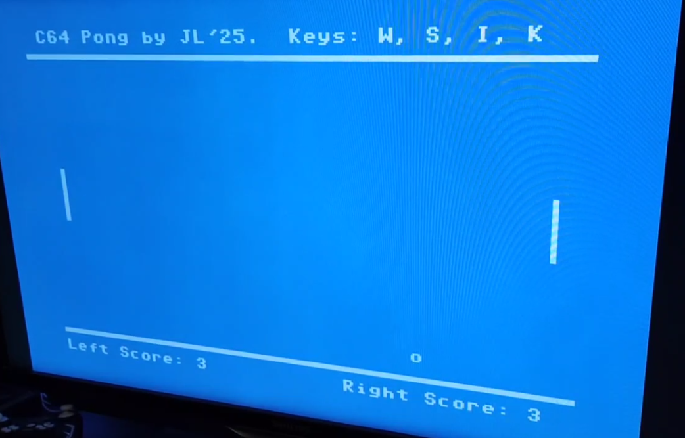

# C64 Pong

This project is a Pong game for the Commodore 64, written in C. It includes sound effects and music using the SID chip.

## Features

- **Gameplay**: Classic Pong game with two paddles and a ball.
- **Sound**: Sound effects for ball hits and crashes, and background music.
- **Controls**: Supports keyboard and joystick input.

## Controls

- **Keyboard**:
    - `W` / `S`: Move left paddle up/down
    - `I` / `K`: Move right paddle up/down
    - `Space` / Joystick button: Start game
    - `Q`: Quit game
    - `D`: Toggle debug mode
    - `M`: Toggle music
    - `S`: Toggle sound effects

## Build and Run

### Prerequisites

- `cl65` (part of the cc65 suite)
- `x64dtv` (part of the VICE emulator)

### Build

To compile the game, run:
```sh
build.bat
```

### Run

To start the game, run:
```sh
run.bat
```

### Game running on the C64 mini
</img>

## License

This project is licensed under the MIT License. See the `LICENSE` file for details.
